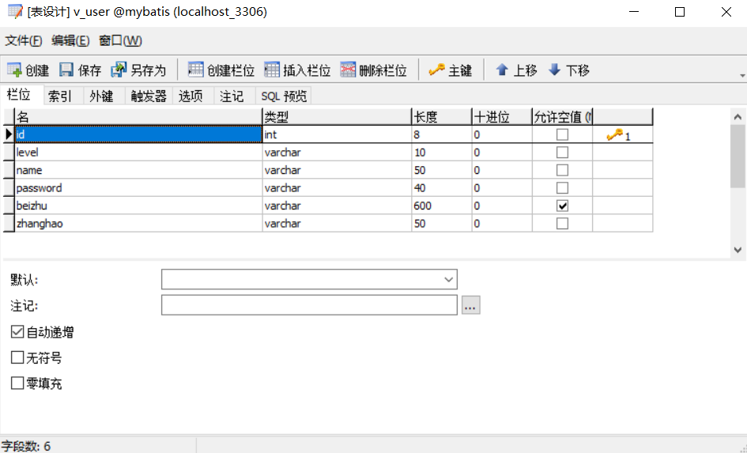
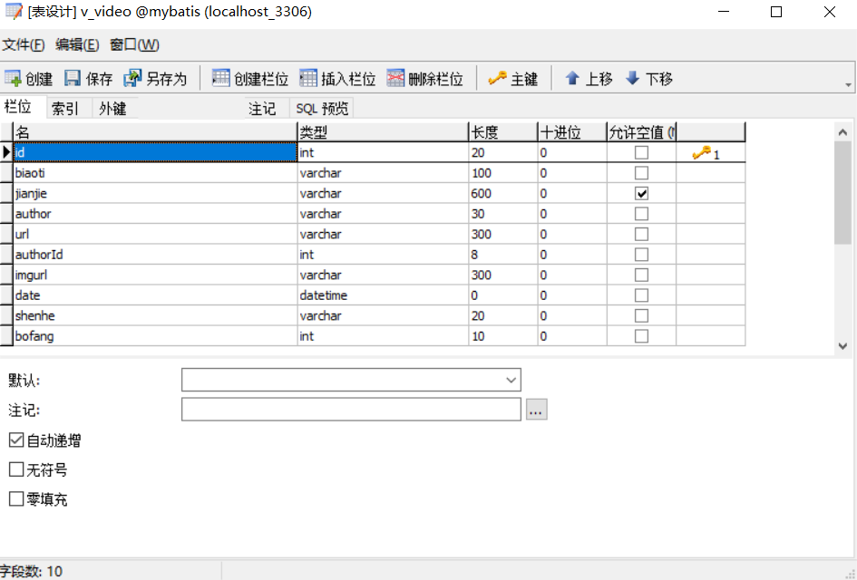
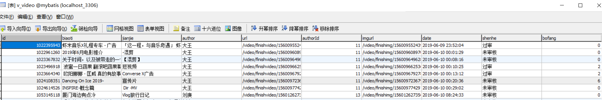
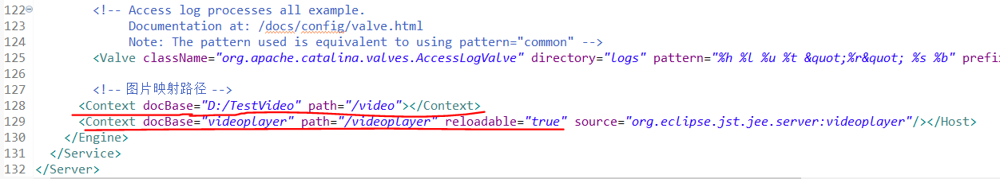
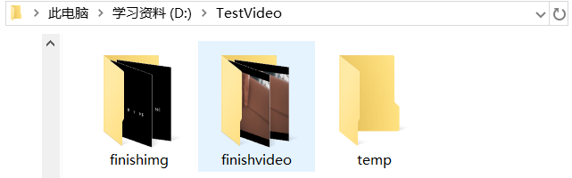
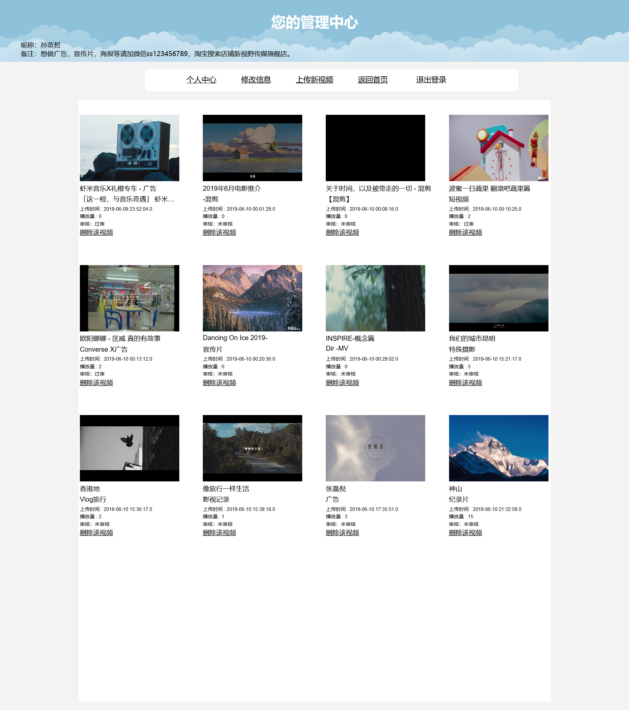
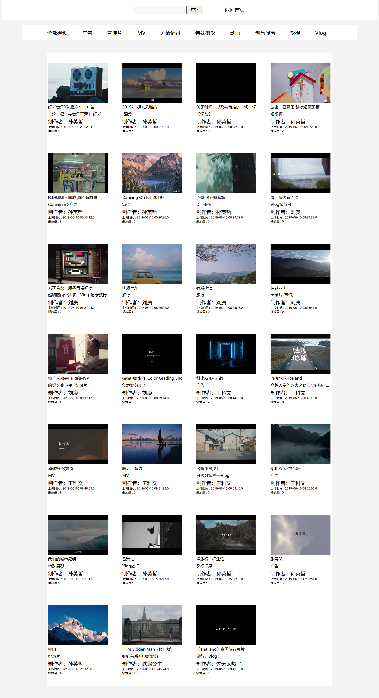
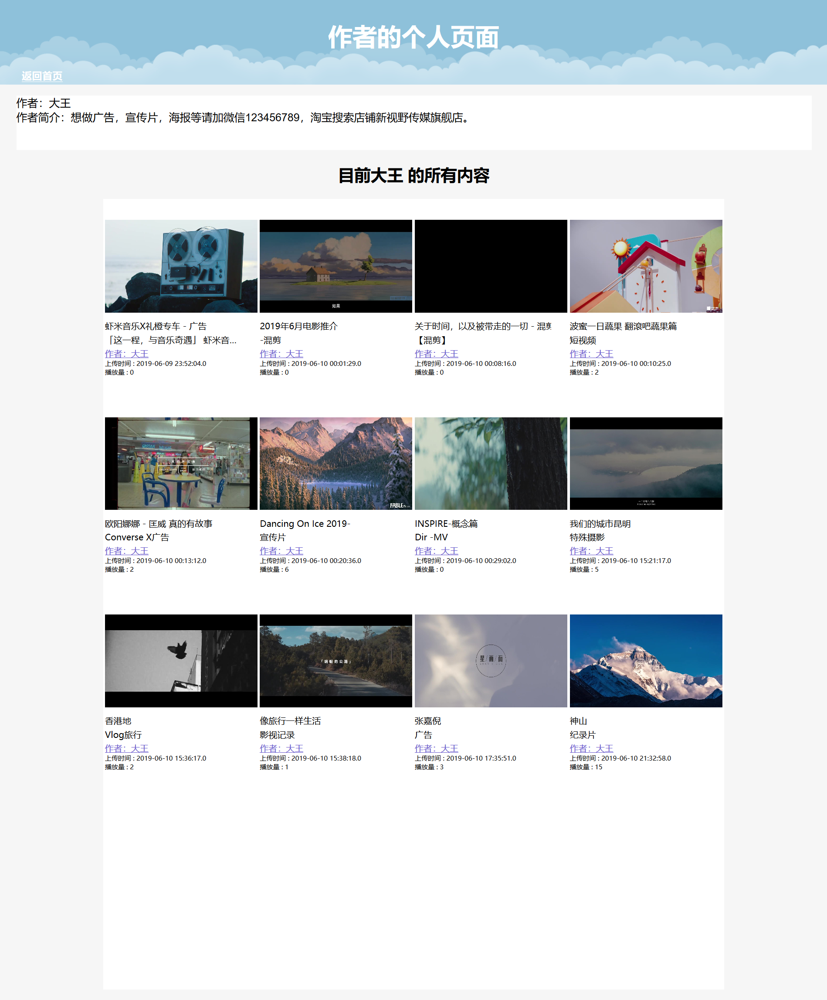

# videoplayer
仿新片场的微视频网站

参考：https://blog.csdn.net/ITBigGod/article/details/81747046

### 技术栈
- **后端**： SSM框架
- **前端**： html+css+js，写好的页面放到jsp文件中
- **video.js插件**
- **ffmpeg转码工具**

### 目前具有功能：
1. **用户登录注册：** 注册后会有自己的管理中心，可以上传视频，查看个人信息；
2. **搜索视频：** 采用模糊查询，在搜索页面有多个分类，可根据视频作者和视频类型搜索；
3. **游客观看搜索视频：点击视频下方的视频作者，可进入到该作者的管理中心，查看全部内容；**
4. **视频信息：** 视频下面有播放量，上传时间，作者等信息；
5. **上传下载视频：** 登录后在自己的管理中心可以上传视频，也可删除自己之前上传的视频；
5. **系统管理员：** 管理员有自己单独的管理页面，可对用户上传的视频进行管理，时候通过审核，如果存在低俗内容可直接删除，
6. 系统管理员的账号和密码为admin和123456789

### 数据库：
数据库名称为mybatis，下面有两个表，一个是v_user，另一个是v_video

用户表v_user和视频表v_video
  

用户表内容

视频表内容（截了一部分图片）

### 运行环境
- **Tomcat v8.0** ，运行后在浏览器中输入网址http://localhost:8080/videoplayer/ ，在浏览器中运行

上传视频是上传到D:\TestVideo\finishvideo   
默认截取第一帧图片D:\TestVideo\finishimg   
还有一个目录：D:\TestVideo\temp，上传的视频先上传到该目录下，然后将视频转化成.mp4的格式，转化完
后将视频存到D:\TestVideo\finishvideo，将第一帧图片存到D:\TestVideo\finishimg

**Tomcat下的server文件配置**

**存储视频和图片的本地地址**

### 页面展示
1. **首页**

2. **登录**

3. **注册**

4. **用户登录后的个人管理中心页面**

5. **修改个人信息页面**

6. **上传视频页面**

7. **搜索页面**

8. **点击作者进入到作者的个人页面**

9. **管理员的管理中心**

### 个人总结
这是第一次写出一个完整的网站页面，在写这些页面的时候还没有掌握太多的知识，有以下体会：
- 在写页面的过程中没有考虑浏览器兼容
  - 最开始跟着教程写京东PC端首页页面的时候是用火狐浏览器进行预览和调试，所以在写这个项目的时候
    也用的火狐浏览器，当几乎所有的页面都完成已经在浏览器进行运行的时候，发现火狐浏览器展示的效果
    没啥问题，放到360浏览器排版就有一些变化，轮播图和下面的视频展示区域都变窄了，在google浏览器上
	有一些特殊字符显示不出来；
  - 在写页面时提前做好自适应的准备
	   a.比如在头部加入viewport元标签；少使用绝对宽度，使用百分比或者 auto；
	   b.加载Normalize.css，规范化。每一个浏览器内部默认的内外边距都不一样，最简单和常见的就是*{padding:0;margin:0;}
	   c.字体用相对大小em，少用px；
	   d.使用流动布局（fluid grid）；float的好处是，如果宽度太小，放不下两个元素，后面的元素会自动
	          滚动到前面元素的下方，不会在水平方向overflow（溢出），避免了水平滚动条的出现。
       e.绝对定位（position: absolute）的使用，也要非常小心。
       f.使用CSS的@media规则，比如
         @media screen and (max-device-width: 400px) {
　　　　		.column {
　　　　　	　float: none;
　　　　　	　width:auto;
　　　		}
　　　		　#sidebar {
　　　　　　		display:none;
　　　　		}
　　		}
		g.图片自适应（fluid image）,img { max-width: 100%;}，实现图片自动缩放